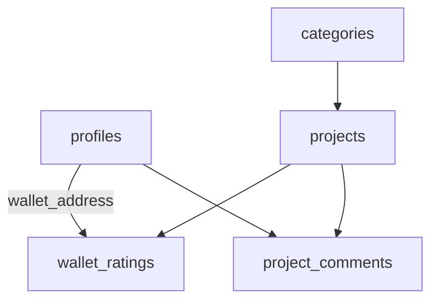

# 🚀 Installation Complète - Kaspa Ecosystem

## 📝 Étape 1 : Préparation Supabase

### A. Activer l'extension UUID (si nécessaire)
```sql
CREATE EXTENSION IF NOT EXISTS "uuid-ossp";
```

### B. Vérifier ce qui existe déjà
```sql
-- Copier/coller le contenu de : supabase/00-check-setup.sql
```

## 🏗️ Étape 2 : Créer les Tables

### Si vous partez de zéro :
```sql
-- Copier/coller TOUT le contenu de : supabase/01-complete-schema.sql
-- Ce script crée TOUTES les tables nécessaires
```

### Si vous avez déjà des tables :
```sql
-- Vérifiez d'abord ce qui existe avec 00-check-setup.sql
-- Puis exécutez seulement les parties manquantes
```

## 🔧 Étape 3 : Configuration Frontend

### A. Vérifier votre configuration Supabase

1. Ouvrez `public/js/supabase-client.js`
2. Vérifiez que l'URL et la clé sont correctes :
```javascript
const SUPABASE_URL = 'https://kxdngctxlxrbjhdtztuu.supabase.co';
const SUPABASE_ANON_KEY = 'votre-anon-key';
```

### B. Tester en local

1. Ouvrez `public/index-functional.html` dans votre navigateur
2. Ouvrez la console (F12) pour voir les logs
3. Cliquez sur "Connect Wallet"
4. Choisissez "Kasware Wallet"

## ✅ Vérification

### Dans Supabase SQL Editor :
```sql
-- Vérifier que tout est OK
SELECT 
    (SELECT COUNT(*) FROM categories) as categories,
    (SELECT COUNT(*) FROM projects) as projects,
    (SELECT COUNT(*) FROM profiles) as profiles,
    (SELECT COUNT(*) FROM wallet_ratings) as ratings;
```

Vous devriez voir :
- categories: 9
- projects: 3 (ou plus)
- profiles: 0 (normal, créés à la connexion)
- ratings: 0 (normal, créés par les users)

## 🐛 Erreurs Fréquentes

### "relation profiles does not exist"
→ Exécutez `01-complete-schema.sql`

### "uuid_generate_v4() does not exist"
→ Exécutez `CREATE EXTENSION IF NOT EXISTS "uuid-ossp";`

### "permission denied for table"
→ Vérifiez que RLS est activé et que les policies existent

### "Failed to fetch"
→ Vérifiez SUPABASE_URL et SUPABASE_ANON_KEY

## 🎯 Structure des Tables



## 📦 Fichiers Importants

- **Frontend fonctionnel** : `public/index-functional.html`
- **Logique wallet** : `public/js/kaspa-wallet-integration.js`
- **App principale** : `public/js/kaspa-ecosystem-functional.js`
- **Schéma complet** : `supabase/01-complete-schema.sql`

## 🚀 Prochaines Étapes

1. **Installer Kasware** : https://kasware.xyz
2. **Déployer sur Netlify**
3. **Configurer Apify** pour le scraping
4. **Ajouter les analytics**

---

**Support** : Si vous avez des problèmes, vérifiez :
1. La console du navigateur (F12)
2. Les logs Supabase (Dashboard > Logs)
3. Le fichier `00-check-setup.sql` pour diagnostiquer
